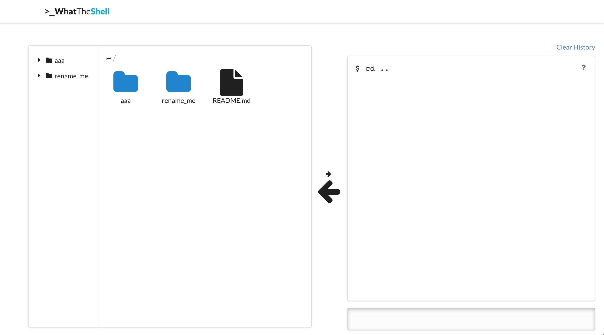
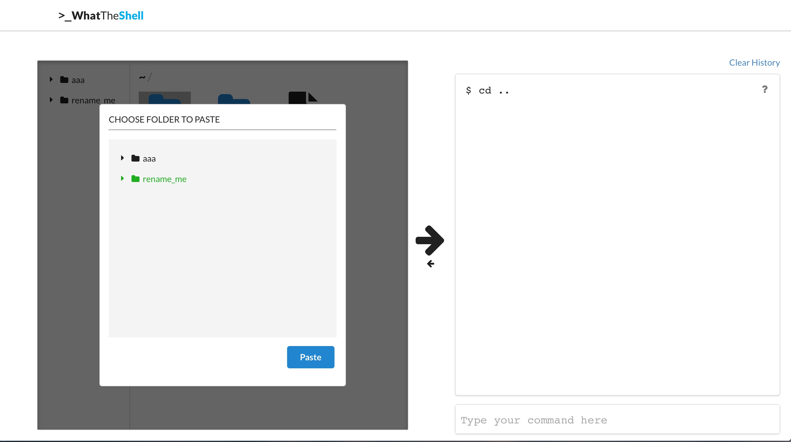
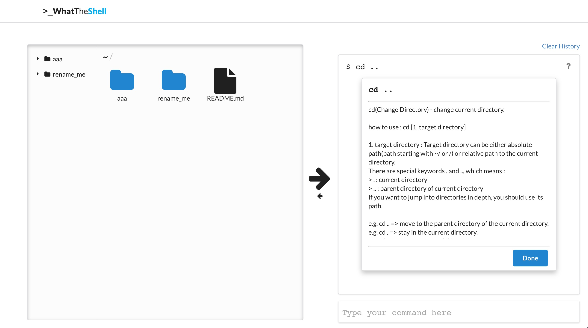
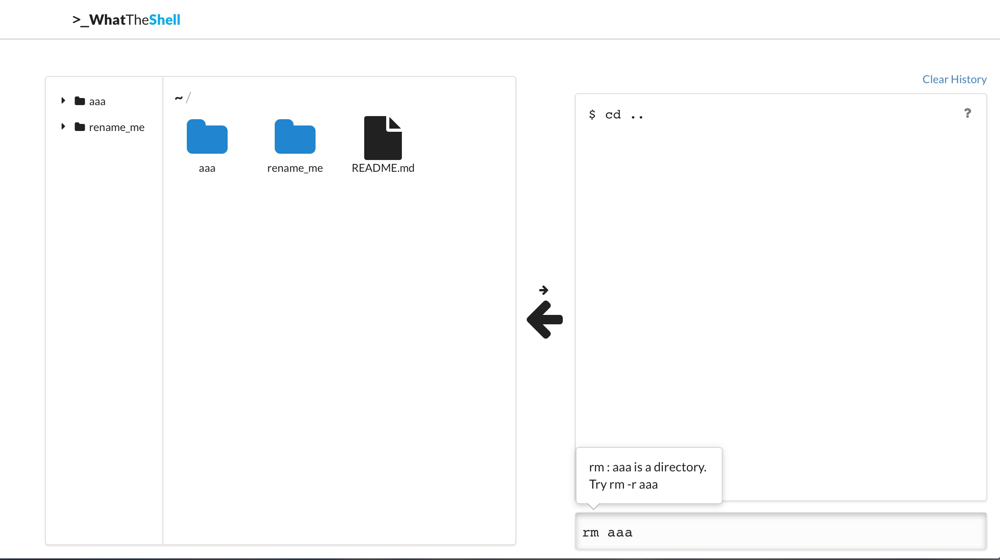

# DP6. Hi-fi Prototyping

## POV

Linux beginners are having difficulties searching about commands, because they are not familiar with the structure of commands and technical terms.

## Target users

Linux beginners who are not familiar with technical terms (especially with less than a month of experience)

## Tasks
    home
    ├── aaa
    │   ├── ccc
    │   ├── hello.c
    │   └── hi.txt
    ├── rename_me
    │   └── trash.txt
    └── README.md

Virtual directories shown above are given to participants.

1. Get a sequence of commands corresponding to given actions
  1. Rename `rename_me` to directory `bbb` 
  2. Delete file `README.md`
2. Get the detailed description about output commands
  1. What does `-r`  do when included in `rm` command?
3. Test user-written commands
  1. Try to delete the folder `bbb` by using a Linux command
  2. Enter  `echo "Hello, World" > hello.txt` to figure out what it means

## Implementation Notes

**Prototype URL**
http://bit.ly/what-the-shell

**Github URL**
https://github.com/gunwooterry/what-the-shell

**Libraries & Frameworks**
Semantic UI
jQuery

**Lessons from heuristic evaluation**

- There is no feedback when a user selects a file or a folder
  We provided a shade which indicates the selected file/folder. It is consistent with the effect of Windows or macOS.
- Users cannot delete history
  We provided a ‘clear history’ button.
- Some users do not get what the website is about
  We added a welcome page with brief instruction when the user loads the website.
- Nothing appears if the user-written command is wrong
  We added a small popup above the input command line to provide concrete feedback for user’s commands.

**Representative screenshots**

Figure 1. Main view of WhatTheShell

Figure 2. Popup window when  `copy` is selected in right-click menu

Figure 3. Manual popup explaining each command

Figure 4. Feedback for a wrong command

## Individual Reflections

**Gunwoo Kim**

- Contributions
  - Rendered folder/file hierarchy in the sidebar and the Finder window
  - Implemented breadcrumb
  - Designed and implemented a welcoming modal
  - Designed the way to show error messages like ‘Command not supported’ (small pop-up above the command line)
  - Added a ‘clear history’ button
  - Handled `cd` and `rm` commands
  - Refactored a large portion of codes (including other team members’ codes) for better readability and consistency
- Difficulties
  - Priority of CSS styles
    Since we used a CSS style library (Semantic UI), multiple styles were applied to the same component. Sometimes, styles we applied are overridden by the default Semantic UI settings. It was hard to deal with priorities of multiple styles. To solve this problem, we coerced our style by using an `!important` tag, even though it is not a good style.
  - Code redundancy in collaboration
    We implemented various features in short time, so we spent less time in modularization. So, each person implemented the functions he needs. It leads to redundant codes, less reusability and readability.
  - Keep consistency with Linux shell commands
    Linux shell commands have complex functionality since it works differently in various cases. Investigating and mimicking its function was complicated.
  - JavaScript code execution pattern
    Unlike other languages, JavaScript codes are not executed in a linear manner. If one function call takes some time (e.g. animation, API request), the next function is called before the previous call is returned. Sometimes it leads to a catastrophic error. To prevent this, we had to understand callback style of JavaScript.
- Skills learned
  - Component focus feature of JavaScript
    In our prototype, when the modal appears, the close button is automatically focused. It enables users to close the modals (including a welcome message and manual windows) by just pressing Enter key.

**Jooyoung Lee**

- Contributions
  - Implemented selection menu on right-click on the GUI window
  - Made popup menu for choosing folder when moving/copying in GUI window
  - Implemented highlighting on icons when clicked
  - Implemented make directory  on both GUI and CUI
  - Implemented mv in GUI and some part of CUI with Suhwan Jee
  - Implemented overall layout
  - Designed and Implemented how to focus current window (By giving deep shadow inside the window)
- Difficulties
  - There were some difficulties coding with team. Since we didn’t read every line of each other’s code, there were some redundant codes. Also, fixing conflicts in Git was challenging since I was new to it.
  - Handling all the exceptions and keeping consistency with real Linux commands was really hard. We had to try commands in many different circumstances to cover all the functionalities of them.
  - Dealing with “position” attribute in HTML was quite challenging. Layout didn’t behave as I expected, and I had to study about exact function of “position” attribute. (Alignment, floating, etc .)
  - Choosing among different design choices was difficult. Convincing and accepting ideas while talking with teammate was hard, but it helped a lot. For example, we talked a lot to choose the method for showing error message to users. (Popup, or dialog box).
- Skills learned
  - I’ve learned a lot about event propagation. I didn’t fully understand how event propagation works, but implementing GUI windows helped me handle. For example, at first when I double click on a folder icon, create folder menu and menus like copy to.. appeared together. Searching and learning more about event propagation and bubbling helped me solve those problems. (Closing popup or undoing folder selection when clicking on other part of the interface, etc .) 

**Suhwan Jee**

- Contributions
  - made arrow button in the center of the screen to change mode
  - implemented mode change by clicking either the arrow button or the GUI window/command line
  - implemented click event of the sidebar items(access directory)
  - implemented delete handler
  - implemented copy, move, delete, rename of the items in sidebar
  - implemented `mv` command parser with Jooyoung Lee
  - implemented file opening by double click
- Difficulties
  - `mv` command has too many corner cases, so we should have tested how does real `mv` command works for every single cases.
  - Vertically align something with CSS was really hard to me.
  - Most of the difficulties are not from implementational issues; i.e. how we can implement this function. They are from how can we translate GUI actions and linux commands better so that Linux beginners can learn many commands more easily and correctly, and thats actually what we spent most of the time to discuss. For example, how can we match copying action in GUI and CLI, where it takes two actions(copy, paste) in GUI while it takes only single, atomic action in GUI? Or, what should be the result of moving directories? Is it `cd [relative path]`, or `cd [absolute path]`?
  - Because we have a lot to implement on backend and there are 4 members in our team, we always need to be in the same context. But since we implemented really fast, it was really hard. The Javascript file is up to 1,400 line, and 3/4 of that code is not written by myself, so I don’t know the all function our team implemented. So at the first, there were many duplicated functions that do the same job. Our team overcame this problem by doing more and more conversations, modularizing functions, and reporting all new functions and implementations every time they finished their small jobs.
- Skills learned
  - This is the first time that I used CSS framework(Semantic UI in this time), and I found that the framework is really powerful and does magical things! I learned how to utilize many web framework by implementing WhatTheShell.

**Youngkyu Hong**

- Contributions
  - Implemented command input and its functionality. (Auto fill-in history using up-arrow key input) (addCommand())
  - Designed history window using grid design
  - Designed manual pop-up for each command (popup after pressing ‘?’ button)
  - Resolved path of all kinds (absolute and relative)
  - Implemented copy, rename in GUI
  - Handled ‘cp’ command input in CUI
  - Handled all kinds of keyboard input in closing all popup using ‘esc’ or adding command using ‘enter’
- Difficulties
  - Since many components are receiving keyboard input, I had to make only focused component get the keyinput. I had to give and release focus manually, and I used variables to distinguish which component is getting keyboard input. Moreover, ‘div’ doesn’t have focus option in default. Therefore, I had to add ‘tabindex’ option to div and bind keydown handler to it.
  - In history window,  fitting each command in grid was difficult especially for long commands. When the command has long word along the end of the grid, it overflowed and destroyed the alignment. I had to use ‘word-wrap: break-word; white-space: normal;’ to handle this difficulties.
  - I also had difficulties in managing alignment especially in grid designing command of history window. ‘display’ option in CSS was not familiar to me.
  - In ‘copy’ popup,  it was difficult to switch the selected one’s color. I handled by using variable maintaining the previous selected directory.  Also, in implementing copy, I had to handle the error of recursive copying in itself, and resolving same name in destination folder.
  - Making better external consistency was difficult. I wanted to handle ‘cp’ command exactly the same way as real linux but in real, ‘cp’ command path attribute had too many variation and it was really difficult to handle each corner case. 
  - Working as team, understanding general functions that others made was difficult. We didn’t have enough discussion about generalizable functions each were implementing so, there were some redundancy in functions.
- Skills learned
  - I learned that adding innerHTML in total to one component is totally messing codes and dangerous in attack. In addCommand(), I just added command in one whole innerHTML, but this way injecting code is really easy.  Instead, I learned that I had to use createTextNode to safely put command. Also, for better manipulation and safe coding, I learned that adding  each component as object and append them to parent component. In addition, it was great chance to learn how to use ES6 syntax such as using ` (quasiquote) at each end for template string like ${}. 

## Studio Reflections

**Compliments**

- Introducing popup is helpful
- Size change of the arrow button clearly implies the button’s function
- The entire interface is intuitive
- Manuals have detailed description

**Suggestions**

- Efficiency
  - Show past commands when user presses up-arrow button in the command line so that users can reuse them
    - Implemented the functionality. Users can traverse through previous command stack by pressing up-arrow key and down-arrow key. These commands appears in the CUI input. 
  - Automatically correct wrong commands
    - It would be perfect if this is supported, but we couldn’t reflect this due to implementation issue.
  - Close all popup windows when clicking on the background
    - We enabled closing modal or popup by clicking on its background.
  - Add ‘Don’t show again’ button for introduction popup at first
    - We recognized this issue, but we didn’t have enough time to implement it. In addition, we are planning to support a tutorial rather than showing welcome popup.
  - Add ‘Go back’ button in GUI window
    - We thought the functionality of ‘Go back’ button is redundant with that of breadcrumb on top of GUI window.
  - Allow users to adjust the size of GUI window and shell window
    - We concluded this is not a critical issue, so we are not planning to implement resizing in this prototype.
  - Add clear button which deletes every command in history window
    -  We implemented this function by adding ‘clear’ button above history window.
- Learnability
  - Describe the meaning of `~` since beginners are new to this
    - We let users to see the meaning of `~` by hovering on `~` on the breadcrumb, but currently it takes a few seconds to see it. It takes too long time, so we will make it immediate in our next iteration.
  - Show hints on available commands
    - We are currently providing possible commands for wrong input only. We are planning to provide ‘command suggestion’ in the next iteration, which is similar to autocomplete. 
  - Colors of folder icons are not consistent in the sidebar and the Finder
    - We made it consistent by making all folder icons blue
- Safety
  - Enable scroll for detailed description popup for each command so that users with small screen size can access the ‘OK’ button
    - We changed manual popup of the command by fixing its position inside the history window, and we provided scroll for long description.

